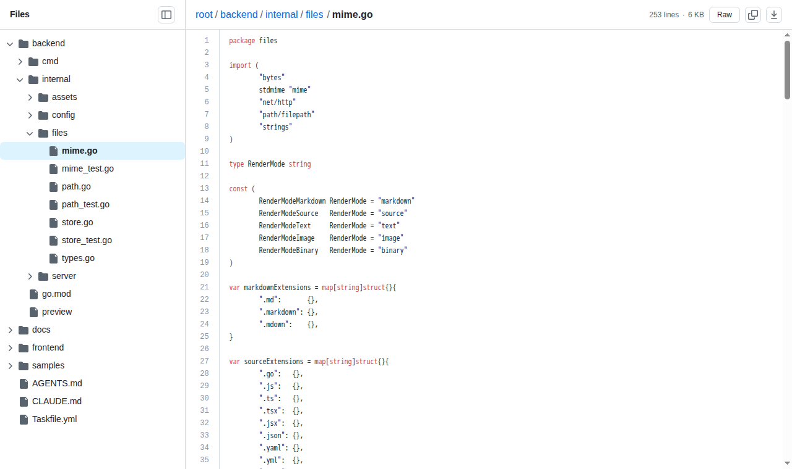

# web-preview

A read-only, single-binary web app for browsing local files from your browser —
a GitHub-style file view for any directory. Rendered Markdown, syntax-highlighted
code, inline image previews, and a live file tree, with **no Git features and no
write access**.

<!-- Replace OWNER/REPO with your GitHub path (e.g. eg-yun/web-preview). -->
[](https://github.com/OWNER/REPO/actions/workflows/ci.yml)
[](https://github.com/OWNER/REPO/releases/latest)
[](LICENSE)



## Features

- **File tree** — expandable, lazy-loaded sidebar; collapses to an overlay drawer on small screens.
- **Markdown** — rendered in GitHub styling (sanitized), with a Code/Preview toggle.
- **Code** — syntax highlighting with a line-number gutter (highlight.js).
- **Images** — inline preview for raster images; SVG previews with a source toggle.
- **Downloads** — non-image binaries and files too large to preview offer a raw download.
- **Live reads** — content is read from disk on every request; no prebuilt snapshot.
- **Single binary** — the frontend is embedded; ship one file. No CDN or external fonts.
- **Read-only** — no upload / edit / delete / rename endpoints.

## Install

**Download a release** (recommended): grab the archive for your OS/arch from the
[latest release](https://github.com/OWNER/REPO/releases/latest), extract it, and
put the `preview` binary on your `PATH`.

**Build from source** (requires Go 1.22+, Node 20+, and [Task](https://taskfile.dev)):

```sh
git clone https://github.com/OWNER/REPO.git web-preview
cd web-preview
task build
./backend/preview --root .
```

## Usage

```sh
preview --root /path/to/dir
# then open http://127.0.0.1:8080
```

### Options

| Flag | Default | Description |
|------|---------|-------------|
| `--root` | (required) | Directory to browse. |
| `--addr` | `127.0.0.1:8080` | Listen address. |
| `--show-hidden` | `false` | Include dotfiles and dot-directories. |
| `--allow-symlink-root <dir>` | — | Extra directory that symlink targets may resolve under (repeatable). |
| `--max-preview-size` | `2MB` | Max file size inlined into the JSON preview; larger files offer a download. |
| `--max-raw-file-size` | `100MB` | Max file size served by the raw endpoint. |
| `--max-dir-entries` | `5000` | Max entries returned per directory listing. |
| `--dev` | `false` | Development mode (pairs with the Vite dev server). |

## Security

- **Read-only** by design — there are no write paths.
- **Binds to loopback** (`127.0.0.1`) by default. Binding to a non-loopback
  address **exposes the readable files to your network** — only do so on a
  trusted network; the server logs a warning when you do.
- Path traversal is rejected, dotfiles are hidden by default, and symlinks are
  followed only when the target stays inside the root (or an explicitly allowed
  `--allow-symlink-root`).
- Markdown HTML is sanitized (DOMPurify) in the browser; raw responses set
  `nosniff` and force downloads for active content (HTML/SVG/JS); a strict CSP
  is applied and there are no external network calls.

The intended threat model is a **trusted document root** browsed by trusted
users — not a root where untrusted parties can rewrite files while the server
reads them.

## Architecture

- **Backend** (Go, standard library): owns filesystem policy, serves the JSON
  data contract and raw file bytes, and embeds the built frontend via `go:embed`
  so everything ships as one binary.
- **Frontend** (Preact + TypeScript + Vite): a SPA that renders entirely from
  the JSON contract (markdown-it, DOMPurify, highlight.js, github-markdown-css).

### Project structure

```text
backend/             Go server (single binary)
  cmd/preview/        CLI entry point
  internal/config/    CLI flags
  internal/files/     path policy, MIME + render-mode detection, file reads
  internal/server/    HTTP handlers
  internal/assets/    embedded frontend (web/); only the minimal index.html is tracked
frontend/            Preact + TypeScript + Vite SPA
  src/                components, signals store, routing/format/render helpers, api client
```

### Data contract

`GET /-/api/fs/*` returns JSON — the single source of truth the frontend renders
from:

- **directory**: `{ kind: "directory", path, entries[], truncated }`
- **file**: `{ kind: "file", path, mime, renderMode, size, content?, rawURL?, tooLarge? }`
- **error**: `{ error: { code, message } }` with a matching HTTP status.

`renderMode` is one of `markdown | source | text | image | binary`. Binary vs.
text is decided by file **content**, not extension. Raster images and SVG use
`image` and preview via `rawURL` (SVG also carries `content` for a source view);
non-image binaries and text over `--max-preview-size` return a download node.

`GET /-/raw/*` streams raw file bytes (downloads and `` sources), under its
own larger size limit.

## Development

Uses [Task](https://taskfile.dev):

```sh
task            # list tasks
task test       # backend + frontend tests
task typecheck  # frontend type-check
task build      # build the frontend and embed it into the Go binary
task serve      # build, then run the server (task serve -- --root /path)
```

## License

[MIT](LICENSE)
